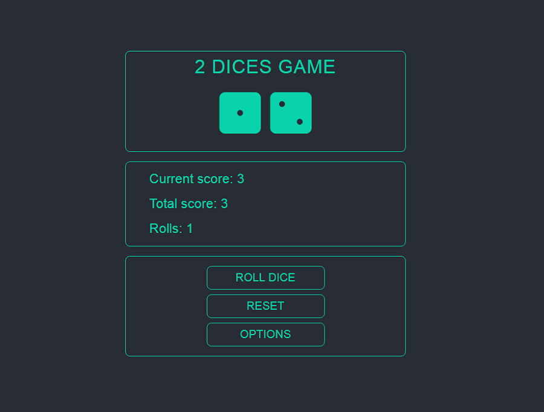

# Dice Game App in React

Dice Game it is a create react app. It was created for desktop and mobile views. Player has to choose number of
dices he would like to play. By pressing button roll dice it will start rolling. After rolling all scores would
be displayed on board. Player can also reset all scores or get back to options. App is also using react-router-dom.

## Tools & Technology used

- Visual Studio Code
- React
- React-router-dom
- HTML
- CSS
- SCSS
- keyframes
- Css modules
- Flexbox
- uuid
